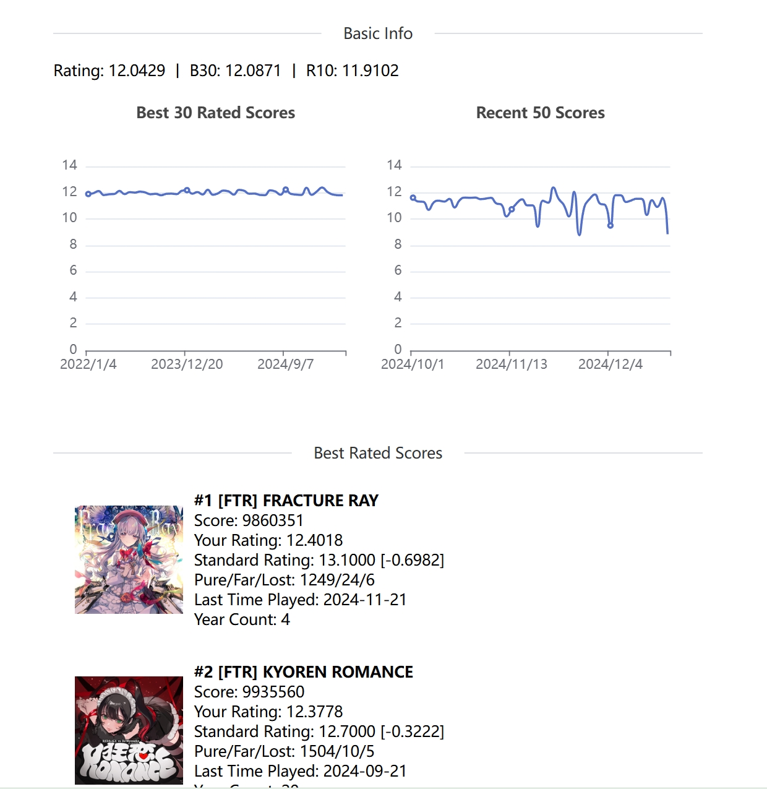

# Archartil

Archartil 是一个 Arcaea 相关的工具仓库

## 功能简介

[预览视频](https://space.bilibili.com/30871838/channel/collectiondetail?sid=222440)

### 1. chartGen 谱面生成
- 基于音频分析的 4K 谱面生成
- 图片/字符转黑线

### 2. chartTrans 谱面转换
- 支持文件格式：节奏大师/Malody/BMS

### 3. scoreView 查分器
- 预览图

## 资源文件
工具可能用到的资源在这里：[resources](https://drive.google.com/drive/folders/1AyOFhFNn-uUynR88ugbGEDhEY_6NmJfT?usp=sharing)

- ``chartGen``
  - ``bookmaker``: 测试用曲与谱面
  - ``img2aff``: 测试用图片与字体
- ``scoreView``
  - ``standard_rating``: v6.0的定数表，来源Wiki
  - ``score.html``: 可供预览的查分界面
- ``ffmpeg.exe``: 多媒体文件转换器

## 更新日志
- **2024/12/15**
  - 增加查分器工具
- **2022/10/24**
  - 增加 BMS 转 Arcaea 谱面
- **2022/10/18**
  - 数据集处理，包括 RM 和 Malody 的 4K 谱面以及 Arcaea 谱面
  - 使用 C-LSTM 模型训练生成采音模型
- **2022/08/27**
  - 添加节奏大师谱面转 aff 功能
- **2022/02/15**
  - 图片转黑线功能
- **2021/10/17**
  - 更新采音策略，使用 spleeter 的旋律鼓点分离方法进行谱面识别，效果一般
- **2021/09/18**
  - 初次提交，使用 librosa 自带的断点检测进行谱面识别

## 版权说明
本工具使用的测试用例音乐及谱面来自部分音乐游戏本体，如有版权问题，请通知本人下架。

## 致谢
- [arcfutil](https://docs.arcaea.icu/)
- [librosa](http://librosa.org/doc/latest/index.html)
- [MalodyBeatmapGenerator](https://github.com/nladuo/AI_beatmap_generator)
- [MalodyBeatmapGenerator (MirrOrangeVer.)](https://github.com/mirrorange/AI_beatmap_generator)